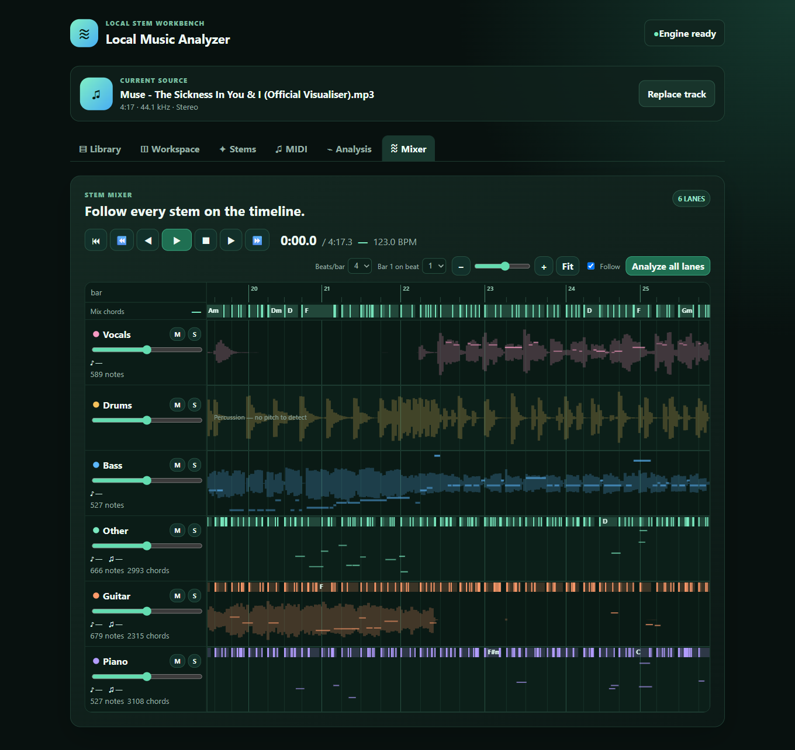

# Local Music Analyzer

[](https://github.com/Strke12i/stem_separation/actions/workflows/ci.yml)
[](LICENSE)

Aplicativo desktop **local e open-source** para separar uma música em stems
(vocal, bateria, baixo, outros) e analisá-la: BPM, tonalidade, acordes, notas
por instrumento e MIDI — tudo rodando na sua máquina, sem enviar áudio a
nenhum serviço externo.



## O que ele faz

A partir de uma faixa local (MP3, WAV, FLAC, M4A, AAC, OGG, OPUS), o app produz:

- **stems por instrumento** (Demucs, 4 ou 6 stems, rodando localmente);
- **BPM e grade de batidas**;
- **tonalidade e timeline de acordes**;
- **notas por stem** (pYIN para baixo/vocal, Basic Pitch para os demais) com
  exportação de MIDI;
- um **mixer estilo DAW**, com uma faixa por stem, solo/mute/volume, waveform,
  notas e acordes sincronizados com a reprodução;
- artefatos JSON reprodutíveis, salvos localmente por música (o mesmo áudio
  nunca é reprocessado duas vezes).

## Plataformas suportadas

**Hoje: só Windows 10/11 x86_64**, testado e com CI rodando nessa plataforma.
A arquitetura foi desenhada para ser portável (o host Rust usa FFmpeg e
Symphonia, não APIs específicas de uma plataforma), mas a descoberta de
FFmpeg, os scripts de instalação de modelo e de empacotamento ainda são
`.ps1` Windows-only. Linux e macOS estão no roadmap (`docs/ROADMAP.md`), não
implementados — ver `docs/PACKAGING.md` para o que falta para portar.

## Como rodar (desenvolvimento)

Pré-requisitos:

- [Rust stable](https://rustup.rs/) (edition 2024, `rust-version = "1.85"`);
- [Node.js 22+](https://nodejs.org/);
- [uv](https://docs.astral.sh/uv/) (gerencia os ambientes Python dos workers);
- FFmpeg no `PATH` (ou instalado via winget — ver `docs/IMPLEMENTATION_STATUS.md`);
- [Tauri CLI prerequisites](https://v2.tauri.app/start/prerequisites/) (WebView2
  já vem com o Windows 10/11 atualizado).

```powershell
git clone https://github.com/Strke12i/stem_separation.git
cd stem_separation/apps/desktop
npm install
npm run tauri dev
```

Isso compila o host Rust, sobe o Vite e abre a janela do app. Os workers
Python (`python/analysis-worker`, `python/amt-worker`) são iniciados pelo
host via `uv run` na primeira análise — não é preciso rodar `uv sync`
manualmente, embora fazê-lo antecipe o download das dependências.

Para separar uma música você também precisa instalar pelo menos um modelo
Demucs localmente (download explícito, nunca automático):

```powershell
.\scripts\install-demucs.ps1 -Model demucs-4
```

Veja `docs/MODEL_MANAGEMENT.md` para o modelo de 6 stems (experimental, com
guitarra e piano separados) e `docs/PACKAGING.md` para gerar um instalador.

### Gates de qualidade

```powershell
cargo fmt --all --check
cargo clippy --workspace --all-targets
cargo test --workspace

cd python/analysis-worker; uv run ruff format --check; uv run ruff check; uv run mypy src tests; uv run pytest
cd python/amt-worker;      uv run ruff format --check; uv run ruff check; uv run mypy src tests; uv run pytest

cd apps/desktop; npx svelte-check; npx vitest run; npm run build
```

O CI (`.github/workflows/ci.yml`) roda os três grupos acima em todo push e
pull request para `main`.

## Licença e avisos de terceiros

Código sob [licença MIT](LICENSE). O app baixa modelos de terceiros (Demucs,
Basic Pitch) sob ação explícita do usuário — eles não são distribuídos neste
repositório. Ver [`NOTICE.md`](NOTICE.md) para a licença de cada modelo e das
principais dependências.

Esta ferramenta não confere nenhum direito sobre o áudio que você processa.
Você é responsável por ter autorização para analisar/separar a música que
importa; nada sai da sua máquina (ver `docs/SECURITY_PRIVACY.md`).

---

## Arquitetura

As seções abaixo documentam as decisões de design para quem for contribuir ou
quiser entender por dentro como o app é construído. `docs/` tem o detalhamento
completo; `docs/DECISIONS.md` registra cada decisão com o motivo.

A arquitetura combina:

- **Rust** para o aplicativo desktop, player/mixer, filesystem, jobs, IPC, cache e supervisão;
- **Python** para separação de stems, MIR e modelos de ML já maduros;
- **Tauri 2** como shell desktop;
- **Svelte + TypeScript** como camada visual;
- **sidecars Python isolados** para proteger o processo principal contra falhas de ML.

## Princípio arquitetural

```text
┌─────────────────────────────────────────────────────────────┐
│                    Desktop Application                      │
│                                                             │
│  Svelte/TS UI                                               │
│      │                                                      │
│      ▼                                                      │
│  Tauri Commands / Events                                    │
│      │                                                      │
│      ▼                                                      │
│  Rust Application Core                                      │
│  ├── audio player/mixer                                     │
│  ├── workspace/files                                        │
│  ├── job scheduler                                          │
│  ├── cache                                                  │
│  ├── model registry                                         │
│  ├── sidecar supervisor                                     │
│  └── IPC contracts                                          │
│      │                                                      │
│      ├──────────── NDJSON/stdin/stdout ──────────────┐       │
│      ▼                                              ▼       │
│ Python Analysis Worker                     Python AMT Worker │
│ ├── audio-separator                        └── Basic Pitch   │
│ ├── librosa                                                │
│ ├── NumPy/SciPy                                            │
│ ├── rhythm                                                │
│ ├── harmony                                               │
│ └── monophonic pitch                                      │
└─────────────────────────────────────────────────────────────┘
```

## Por que não embutir Python no processo Rust?

O projeto privilegia isolamento.

Operações de ML podem:

- consumir muita RAM/VRAM;
- falhar ao carregar um modelo;
- provocar OOM;
- carregar runtimes pesados;
- possuir árvores de dependências incompatíveis.

O aplicativo Rust deve sobreviver a esses problemas.

Por isso, o padrão inicial é:

```text
Rust host
    |
    └── managed Python sidecar
```

e não:

```text
Rust host
    |
    └── embedded CPython
```

PyO3 continua sendo uma ferramenta permitida para integrações futuras específicas, mas não é a fronteira principal do MVP.

## Linguagem por responsabilidade

### Rust

Usar para:

- desktop lifecycle;
- Tauri commands/events;
- path safety;
- hash;
- filesystem;
- manifests;
- atomic writes;
- jobs;
- cancellation;
- timeout;
- process supervision;
- audio playback;
- stem synchronization;
- waveform peak generation;
- cache;
- resource limits;
- hardware discovery;
- orchestration;
- IPC.

### Python

Usar para:

- stem separation;
- PyTorch/ONNX-based models;
- librosa;
- BPM/beat analysis;
- chroma;
- key detection;
- chord recognition;
- pYIN;
- Basic Pitch;
- experimentation with MIR/ML.

### TypeScript/Svelte

Usar apenas para apresentação e interação:

- mixer controls;
- timeline;
- waveform;
- settings;
- model manager UI;
- progress;
- errors.

A UI não implementa regras de negócio nem DSP.

## Estrutura alvo

```text
local-music-analyzer/
├── apps/
│   └── desktop/
│       ├── src/                     # Svelte/TypeScript UI
│       └── src-tauri/
│           ├── src/
│           │   ├── commands/
│           │   ├── audio/
│           │   ├── jobs/
│           │   ├── ipc/
│           │   ├── models/
│           │   ├── supervisor/
│           │   ├── workspace/
│           │   └── state/
│           └── binaries/            # release sidecars
├── crates/
│   ├── analyzer-domain/
│   ├── analyzer-protocol/
│   ├── analyzer-audio/
│   └── analyzer-test-support/
├── python/
│   ├── analysis-worker/
│   │   └── src/music_analyzer_worker/
│   └── amt-worker/
│       └── src/music_analyzer_amt/
├── schemas/
├── tests/
│   ├── fixtures/
│   └── synthetic/
├── scripts/
├── models/
└── workspace/
```

## Regra de dependência

```text
UI
 ↓
Rust application
 ↓
Rust domain/protocol
 ↓
Python workers

Python nunca chama a UI.
UI nunca chama Python diretamente.
```

## Ordem de leitura para o Codex

1. `AGENTS.md`
2. `ARCHITECTURE.md`
3. `RUST_PYTHON_BOUNDARY.md`
4. `TECH_STACK.md`
5. `IPC_PROTOCOL.md`
6. `AUDIO_ENGINE.md`
7. `AUDIO_PIPELINE.md`
8. `DATA_CONTRACTS.md`
9. `RESILIENCE.md`
10. `PERFORMANCE.md`
11. `SECURITY_PRIVACY.md`
12. `TESTING.md`
13. `PACKAGING.md`
14. `UI_SPEC.md`
15. `ROADMAP.md`
16. `CODEX_WORKFLOW.md`
17. `DECISIONS.md`
18. `REFERENCES.md`

A primeira tarefa está em `PROMPT_INICIAL_CODEX.md`.
